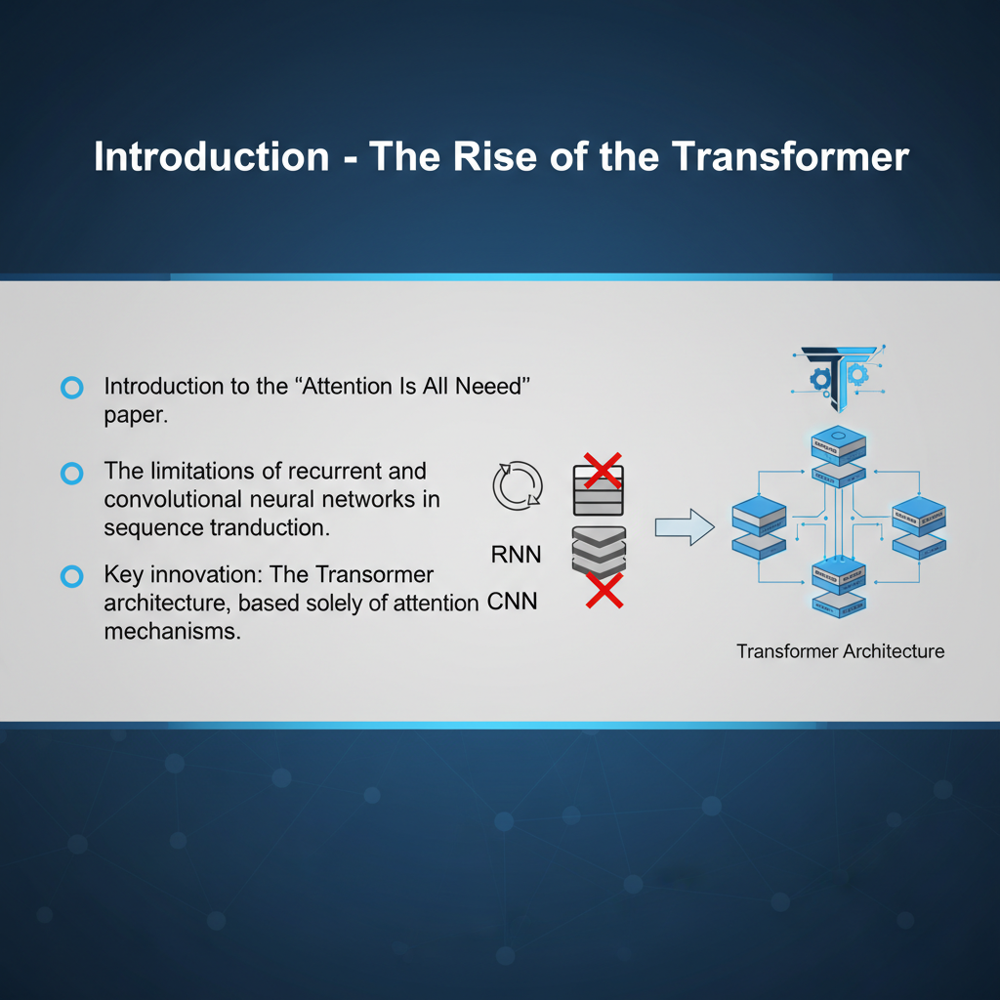
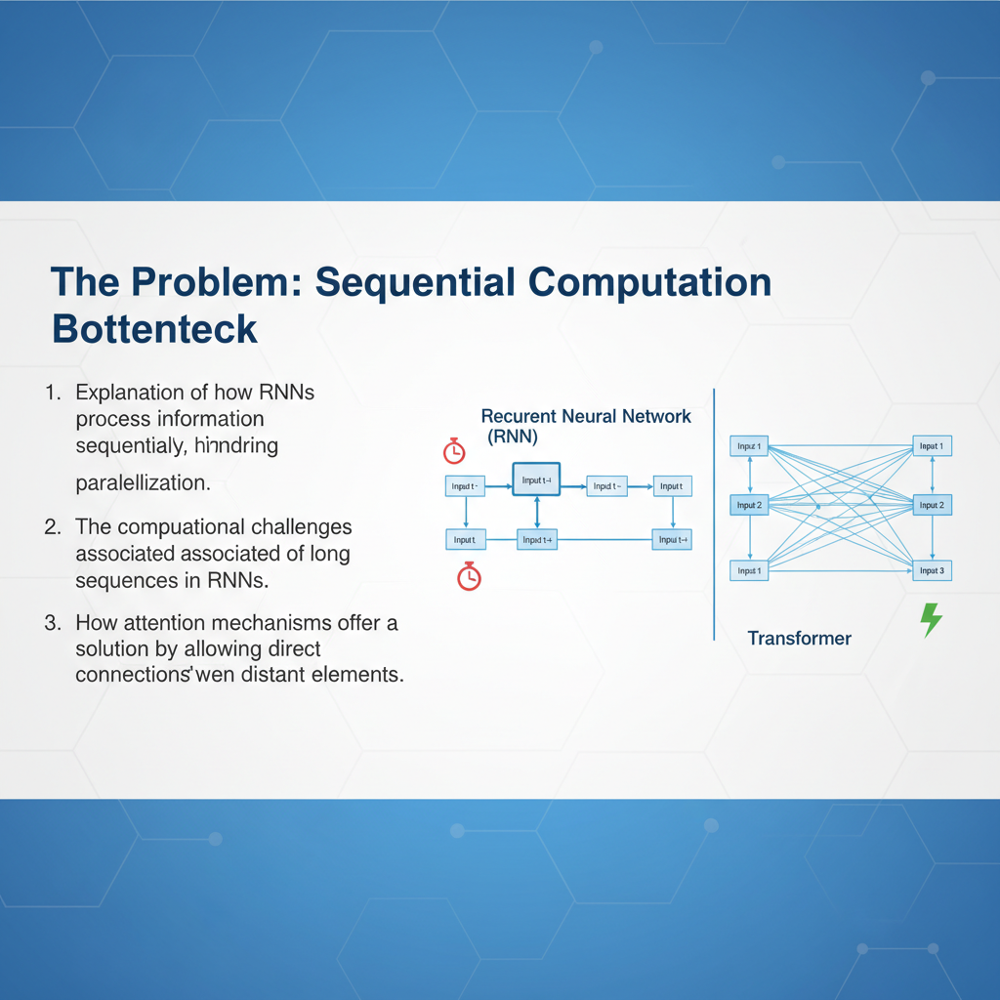
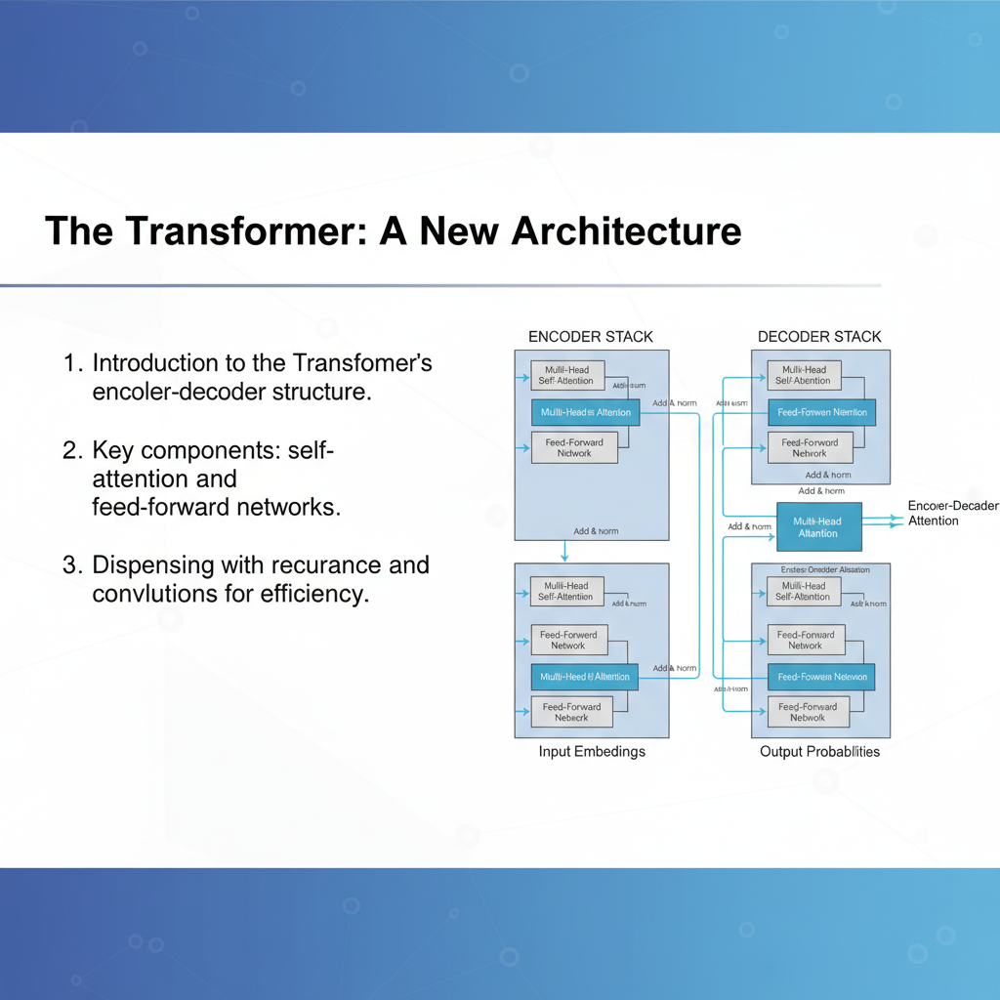
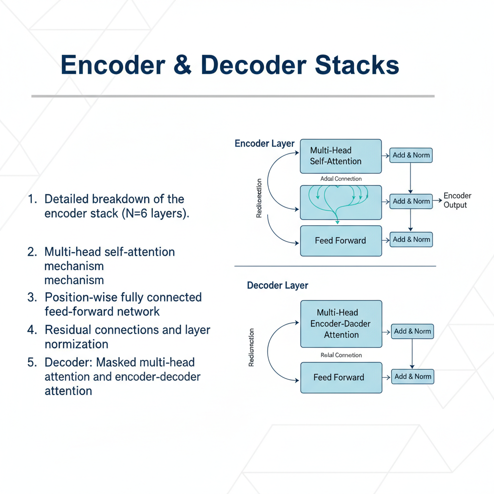

# 🍌 BananaDeck

**Transform any content into stunning presentations with AI-powered slide generation**

BananaDeck is an intelligent presentation generator that converts PDFs and YouTube videos into professional, visually-rich presentation slides using Google's Gemini AI. Whether you're analyzing research papers, educational content, or video lectures, BananaDeck automatically creates engaging presentations with custom visuals, infographics, and structured content.


*Example of AI-generated presentation slide from BananaDeck*

## ✨ Why BananaDeck?

- **🎯 One-Click Conversion**: Transform PDFs and YouTube videos into presentation-ready slides instantly
- **🤖 AI-Powered Intelligence**: Leverages Google Gemini AI for content analysis and visual generation
- **📊 Smart Visual Design**: Automatically creates charts, infographics, and diagrams based on content
- **🎨 Professional Aesthetics**: Generates slides with consistent theming and corporate-grade design
- **⚡ Iterative Refinement**: Expand individual slides for deeper content exploration
- **🌐 API-Ready**: Built with FastAPI for easy integration into existing workflows

## 🚀 Features

### 📄 Multi-Format Input Support
- **PDF Documents**: Convert research papers, reports, and documents into presentations
- **YouTube Videos**: Extract content from educational videos, lectures, and tutorials
- **Smart Content Analysis**: AI automatically identifies key concepts, data points, and visual opportunities

### 🎨 Intelligent Slide Generation
- **Content Structure**: Automatically organizes content into logical presentation flow
- **Visual Suggestions**: AI recommends appropriate charts, graphs, and infographics for each slide
- **Professional Design**: Consistent theming with corporate-grade aesthetics


*Professional slide design with custom visuals and infographics*

### 🔧 Advanced Capabilities
- **Slide Expansion**: Split any slide into multiple detailed slides for deeper exploration
- **Version Management**: Organized output structure with version control (v0, v1, etc.)
- **Batch Processing**: Generate multiple slides simultaneously
- **REST API**: Programmatic access via FastAPI endpoints

### 📁 Organized Output
```
outputs/
├── project_name/
│   ├── content.md                    # Original content
│   ├── v0/
│   │   ├── presentation.md          # Slide structure
│   │   └── slides/                  # Generated slide images
│   │       ├── slide_01.png
│   │       ├── slide_02.png
│   │       └── ...
│   └── v1/                          # Expanded versions
│       ├── presentation_expanded.md
│       └── slides/
```

## 🛠️ Setup

### Prerequisites
- Python 3.11 or higher
- Google Gemini API key

### Installation

1. **Clone the repository**
   ```bash
   git clone <repository-url>
   cd bananadeck
   ```

2. **Install dependencies using uv (recommended)**
   ```bash
   uv sync
   ```
   
   Or using pip:
   ```bash
   pip install -e .
   ```

3. **Set up environment variables**
   Create a `.env` file in the project root:
   ```bash
   GEMINI_KEY=your_gemini_api_key_here
   ```

4. **Get your Gemini API key**
   - Visit [Google AI Studio](https://makersuite.google.com/app/apikey)
   - Create a new API key
   - Add it to your `.env` file

### Usage

#### Command Line Interface

**Process a PDF file:**
```python
from bananadeck.backend.main import process_input

# Process a PDF document
process_input("path/to/your/document.pdf")
```

**Process a YouTube video:**
```python
# Process a YouTube video
process_input("https://www.youtube.com/watch?v=VIDEO_ID")
```

**Expand a specific slide:**
```python
from bananadeck.backend.main import expand_slide

# Expand slide 3 into multiple detailed slides
expand_slide("path/to/input", slide_number=3)
```

#### API Server

**Start the API server:**
```bash
python -m bananadeck.backend.server
```

**API Endpoints:**
- `POST /process` - Process input file or URL
- `GET /health` - Health check
- `GET /docs` - Interactive API documentation

**Example API usage:**
```bash
curl -X POST "http://localhost:8000/process" \
     -H "Content-Type: application/json" \
     -d '{"input_path": "path/to/your/document.pdf"}'
```

### Example Workflow

1. **Input**: Upload a research paper PDF or YouTube video URL
2. **Analysis**: AI analyzes content and extracts key concepts
3. **Structure**: Content is organized into logical presentation flow
4. **Generation**: Professional slides are created with custom visuals
5. **Refinement**: Expand specific slides for deeper content exploration

## 🖼️ Gallery

Here are some examples of slides generated by BananaDeck:


*Slide with data visualization and structured content*


*Professional slide with clean design and clear messaging*

## 📋 Dependencies

- `google-genai` - Google Gemini AI integration
- `fastapi` - Web API framework
- `pillow` - Image processing
- `uvicorn` - ASGI server
- `python-dotenv` - Environment variable management

## 🤝 Contributing

We welcome contributions! Please feel free to submit issues, feature requests, or pull requests.

## 📄 License

This project is licensed under the MIT License - see the LICENSE file for details.

---

**Ready to transform your content into compelling presentations? Get started with BananaDeck today!** 🚀